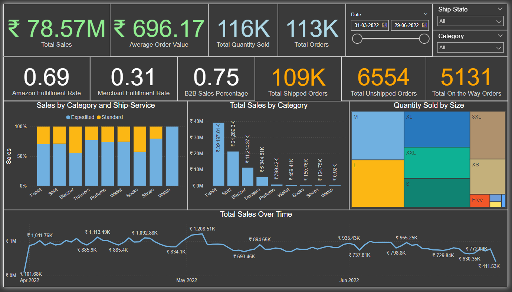

# E-commerce Performance Analytics and Sales Trend Dashboard

## Project Overview
This interactive dashboard provides a comprehensive analysis of e-commerce sales data, focusing on key performance metrics, sales trends, and fulfillment analytics. As an aspiring data analyst, I developed this visualization to demonstrate my ability to analyze complex e-commerce data and derive actionable insights for business decision-making.

Data Source: [Amazon Sales Report](https://www.kaggle.com/datasets/arpit2712/amazonsalesreport)

## Dashboard Components

### Key Performance Indicators (Cards)
- Total Sales: ₹78.57M
- Average Order Value: ₹696.17
- Total Quantity Sold: 116K
- Total Orders: 113K

### Fulfillment Metrics (Cards)
- Amazon Fulfillment Rate: 0.69
- Merchant Fulfillment Rate: 0.31
- B2B Sales Percentage: 0.75
- Total Shipped Orders: 109K
- Total Unshipped Orders: 6554
- Total On the Way Orders: 5131

### Interactive Filters
- Date Range Slider: From 31-03-2022 to 29-06-2022
- Ship-State: Dropdown to filter by shipping state
- Category: Dropdown to filter by product category

### Visualizations

1. **Sales by Category and Ship-Service (Stacked Bar Chart)**
   - Compares sales distribution across product categories and shipping services (Expedited vs Standard)
   - Insight: Most categories show a preference for expedited shipping, with T-shirts having the highest proportion of expedited shipments

2. **Total Sales by Category (Bar Chart)**
   - Visualizes total sales for each product category
   - Insight: T-shirts are the top-selling category, followed by shirts and blazers

3. **Quantity Sold by Size (Treemap)**
   - Displays the distribution of sales across different product sizes
   - Insight: L and XL sizes are the most popular, with M and XXL following closely

4. **Total Sales Over Time (Line Chart)**
   - Tracks daily sales trends from April to June 2022
   - Insight: Sales show fluctuations with notable peaks and troughs, potentially indicating weekly patterns or promotional impacts

## Business Impact and Insights

1. **Sales Performance:**
   - With total sales of ₹78.57M and 113K orders, the average order value of ₹696.17 indicates a healthy per-transaction revenue.
   - The B2B sales percentage of 75% suggests a strong focus on business customers, which may impact marketing and sales strategies.

2. **Fulfillment Efficiency:**
   - The Amazon Fulfillment Rate of 0.69 indicates that a significant portion of orders are fulfilled through Amazon's services, potentially benefiting from their logistics network.
   - With 109K shipped orders out of 113K total, the fulfillment process appears efficient, but there's room for improvement in reducing unshipped and on-the-way orders.

3. **Product Category Insights:**
   - T-shirts, shirts, and blazers are the top-selling categories, suggesting areas for potential inventory focus and marketing efforts.
   - The preference for expedited shipping across most categories indicates customers value quick delivery, which could be leveraged for premium shipping options or loyalty programs.

4. **Inventory Management:**
   - The popularity of L and XL sizes across products highlights the importance of maintaining adequate stock in these sizes to meet demand.

5. **Sales Trends:**
   - The fluctuating sales trend over time suggests potential for targeted promotional activities during typically lower-performing periods to boost sales.

## Skills Demonstrated
- E-commerce data analysis and interpretation
- Dashboard design and data visualization using Excel and Power BI
- Time series analysis of sales data
- Category and size-based product performance analysis
- Calculation and interpretation of key e-commerce metrics

## About the Creator  
Rishav Singh Rajput - Aspiring Data Analyst  
Email - rishavsrajput@gmail.com  
LinkedIn Profile - [www.linkedin.com/in/rishav-rajput](https://www.linkedin.com/in/rishav-rajput)

I'm passionate about leveraging data to drive e-commerce strategy and optimize online retail operations. I'm actively seeking opportunities in e-commerce analytics and data science. Feel free to reach out to discuss this project or potential collaborations!
